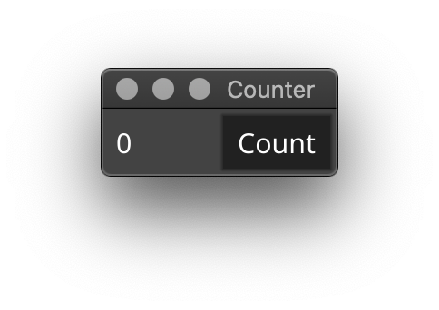
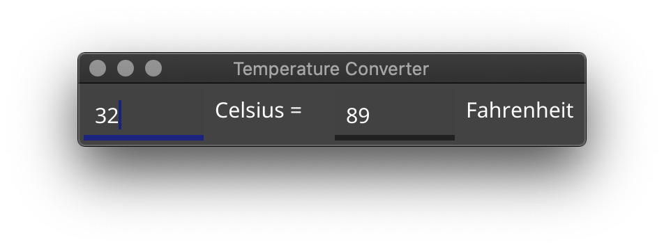
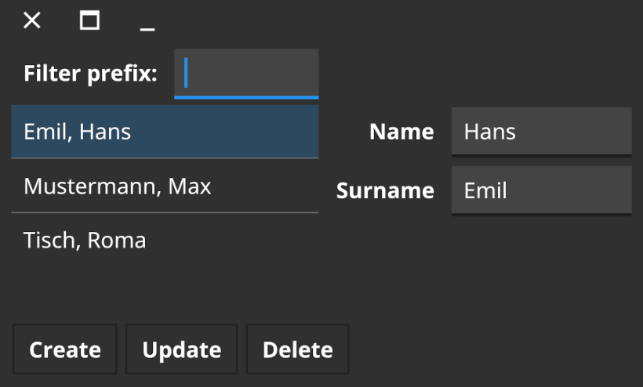

# 7 GUIs using Fyne

An implementation of the [7 GUIs challenge](https://eugenkiss.github.io/7guis/)
using the [Fyne](https://fyne.io) toolkit.

## Counter

A simple counter that increments each time the "Count" button is pressed.

`go get github.com/fyne-io/7guis/counter`

## Temperature Converter

The temperature converter allows users to enter a value in degrees C or
degrees F and will automatically update the other field.

`go get github.com/fyne-io/7guis/temperature-converter`

## CRUD

Demonstration of how data is separated from rendering supporting create,
read, update and delete.

`go get github.com/fyne-io/7guis/crud`

